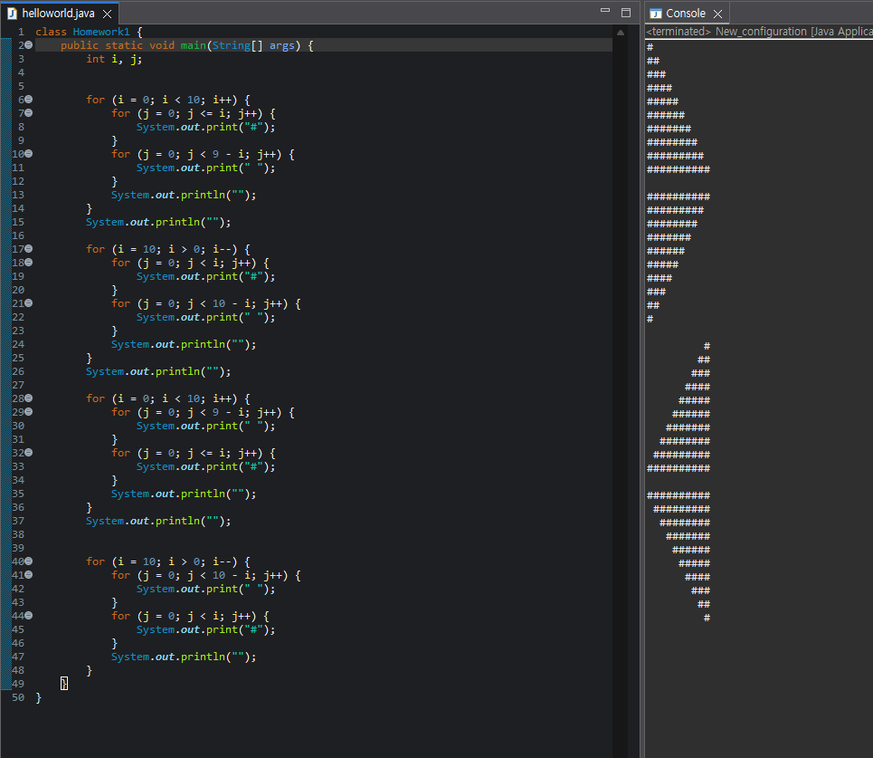
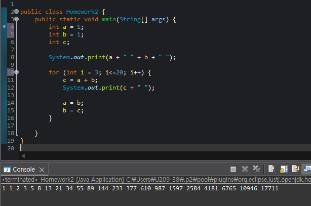
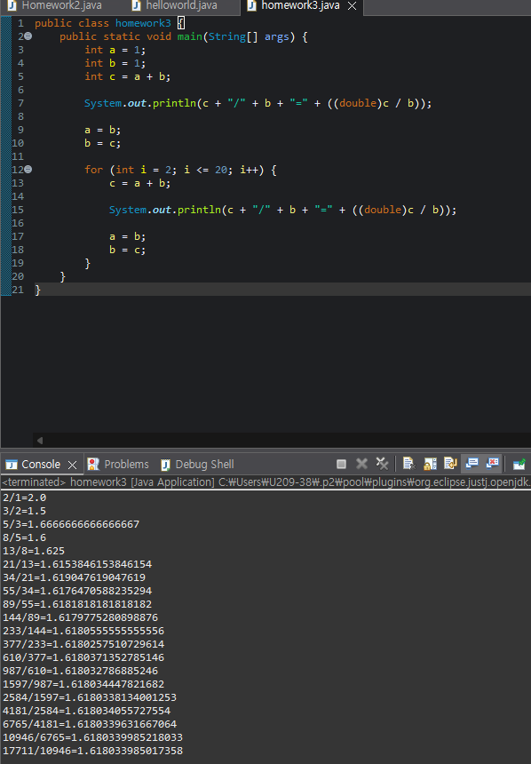

# OOP2026
### Homework1
```java
class Homework1 {
    public static void main(String[] args) {
        int i, j;
        

        for (i = 0; i < 10; i++) {
            for (j = 0; j <= i; j++) {
                System.out.print("#");
            }
            for (j = 0; j < 9 - i; j++) {
                System.out.print(" ");
            }
            System.out.println("");
        }
        System.out.println("");
  
        for (i = 10; i > 0; i--) {
            for (j = 0; j < i; j++) {
                System.out.print("#");
            }
            for (j = 0; j < 10 - i; j++) {
                System.out.print(" ");
            }
            System.out.println("");
        }
        System.out.println("");
        
        for (i = 0; i < 10; i++) {
            for (j = 0; j < 9 - i; j++) {
                System.out.print(" ");
            }
            for (j = 0; j <= i; j++) {
                System.out.print("#");
            }
            System.out.println("");
        }
        System.out.println("");
        

        for (i = 10; i > 0; i--) {
            for (j = 0; j < 10 - i; j++) {
                System.out.print(" ");
            }
            for (j = 0; j < i; j++) {
                System.out.print("#");
            }
            System.out.println("");
        }
    }
}
```


### Homework2
```java
public class Homework2 {
	public static void main(String[] args) {
		int a = 1;
		int b = 1;
		int c;
		
		System.out.print(a + " " + b + " ");
		
		for (int i = 3; i<=20; i++) {
			c = a + b;
			System.out.print(c + " ");
			
			a = b;
			b = c;
		}
		
	}
}
```


### Homework1
```java
public class homework3 {
    public static void main(String[] args) {
        int a = 1;
        int b = 1;
        int c = a + b;

        System.out.println(c + "/" + b + "=" + ((double)c / b));

        a = b;
        b = c;

        for (int i = 2; i <= 20; i++) {
            c = a + b;
            
            System.out.println(c + "/" + b + "=" + ((double)c / b));

            a = b;
            b = c;
        }
    }
}
'''


